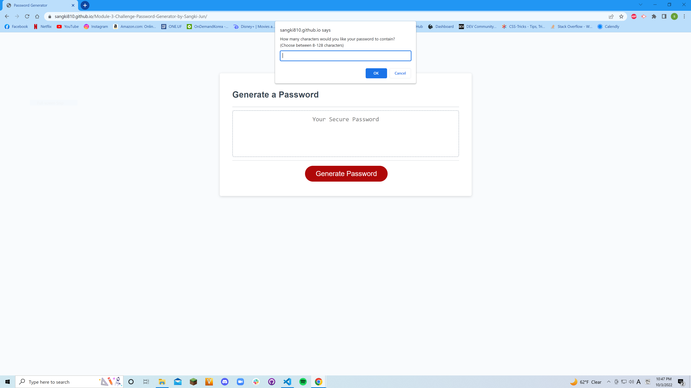

# Module 3 Challenge: Password Generator by Sangki Jun
## Description
This website is the completed assignment for module 3 challenge from the UCF FSF Bootcamp. The creator was given a startor code which contained all HTML and CSS content as well as a bit of starter JavaScript. Only the JavaScript running the logic for password generation was written by the creator, with the help of a certain youtuber credited below.
## Installations
N/A
## Usage
This website produces a random password where the length and types of characters to include in it are chosen by the user. The range for the length is 8 to 128 characters and the user can choose any configuration of four different character types. The types are: lower case letters, upper case letters, numbers, and special characters.
## Credits
YouTube Channel: Traversy Media 
Link to video: https://www.youtube.com/watch?v=duNmhKgtcsI 
The video in the link from the channel Traversy Media had great influence on the completed assignment and parts of codes in the finished site come either directly or indirectly from the video.
## License
N/A
## Links and Screenshot
Live URL: https://sangki810.github.io/Module-3-Challenge-Password-Generator-by-Sangki-Jun/  
